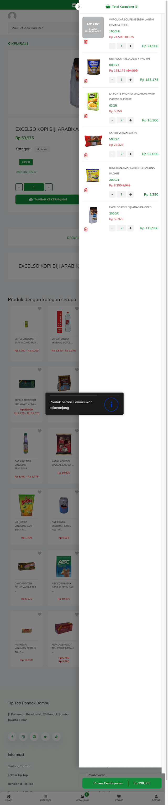

# Top Shop Auto

Top Shop Auto adalah sebuah skrip Python yang memudahkan berbelanja online di [Tiptop](https://shop.tiptop.co.id).

Saat ini, ini baru mendukung pembelian kembali dari order yang telah dibuat
sebelumnya. Skrip ini menerima file HTML yang disimpan dari pemesanan di Tiptop
Shop sebelumnya. Kemudian skrip akan menjalankan browser Chrome untuk melakukan
pembelian online.

Selanjutnya, anda dapat melanjutkan belanja anda atau langsung _checkout_ jika
semua barang sudah ada di keranjang.

## Prasyarat

- Python 3.8 atau yang lebih baru.
- [pipenv](https://pipenv.pypa.io/en/latest/)

## Instalasi

Untuk menggunakan Top Shop Auto, klon repo ini dan jalankan:

```bash
pipenv install
```

## Penggunaan

1. Buka `reorder.py` dan ubah variabel `branch` sesuai dengan kebutuhan Anda.
2. Taruh file HTML yang disimpan dari Tiptop Shop ke dalam folder repositori ini.
   Pastikan namanya sesuai dengan yang direferensikan di `reorder.py`.

    Jika ingin mencoba dengan demo file HTML yang tersedia di repo ini, silahkan
    duplikasi file `demo-order.html` dan namakan dengan `order.html`.

3. Jalankan `pipenv run python reorder.py`.

Skrip akan menjalankan browser Chrome melalui [pyppeteer](https://github.com/pyppeteer/pyppeteer)
untuk melakukan belanja online di Tiptop Shop berdasarkan barang-barang yang ada
di file HTML. Setelah selesai, browser akan tetap terbuka untuk Anda ambil alih
sesuai dengan kebutuhan belanja Anda.

Jika berhasil, skrip akan menangkap gambar keranjang dan menyimpannya ke dalam
folder `images`. Anda dapat menggunakan file ini untuk mengirim ke Tiptop
Shop.

## Fitur

- pemasukan kembali ke keranjang barang-barang yang telah dibeli dari order
yang telah dibuat sebelumnya.

- pemasukan kembali ke keranjang barang-barang yang telah dimasukkan ke dalam
keranjang anda. Ini berguna jika anda belum memproses keranjang anda dan masih
ingin berdiskusi namun datanya hilang karena suatu hal, seperti browser anda
_crash_ atau situs gagal menyimpan data anda.

## Demo

Lihat demo berikut:

[](https://youtu.be/WvL8K8uz2Nk)

Contoh screenshot:

[](images/demo-tiptop_cart_202412271026.png)

## Lisensi

Top Shop Auto adalah kode sumber terbuka yang dikelola di bawah lisensi GPL V3.
